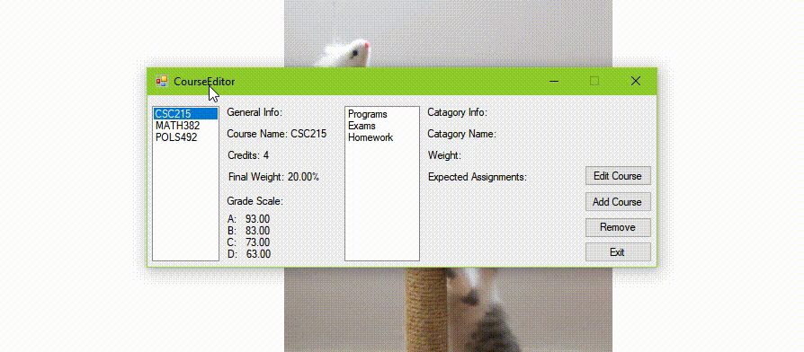
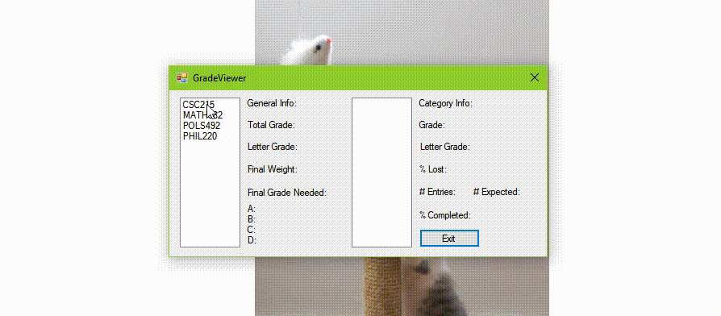

## School Helper 2.0

 - Last Updated: 6/13/2020
 - Languages: C# and SQL
 - Technologies: SQL Server
 
#### Program Description: 
 
While I went to school at SDSM&T, the grading system varied from professor to professor. While for most courses this was not a problem, there was a few courses where I wouldn't know my grade for the majority of the semester. In order to tackle this problem, while also developing a couple of extra tools, I developed this program to help with my school.
 
This tool allows the user to input information that relates their courses, stores it within a database, to utilize the tools to gain further insight of how they are currently doing in their courses and what areas need focus. Incase the database is unavailable or fails to connect, the program does consistently saves the course information in a filesystem. The interface to view, input, and modify this information is super user friendly and allows for quick edits to multiple parts. Adding grades is the same process as well.

When all the information is in the program, then we can view the grade information for the course, and have an insight of my overall performance. Here is what the following we can view and what the program calculates for us:
* What the current grade is (both as a percentage and a letter).
* What grade I would need on my final for each letter grade.
* What is my grade for each category under the course.
* How much of my overall grade I am losing from each category.
* How much of the category is completed.

 
#### Note:

This is an upgraded version of my School Helper application. To see what my original project, click [here](https://github.com/JacksonCates/School-Helper).

Here are the updates I have made from the previous version:
 * Moved the framework from console application to Windows forms.
 * Move data storage from excel files to a database on SQL Server.
 * Added a course editor.
 * Changed a few of the algorthims to decreasing waiting times.

#### Future Updates:

I am still developing this app! Here are some updates I plan to include in the future:
 * Utilize SQL database to make a mobile app so I can view my courses and manipulate the database.
 * Add GPA manager from previous version.

#### Techniques/Methods Used:
 * Object oriented programming
 * Windows Forms
 * Events
 * Simple UI/UX
 * SQL Data manipulation
 * SQL Table joining
 * Algorithm Complexity (Big O)
 * File manipulation/management (Binary files)
 * Git source control
